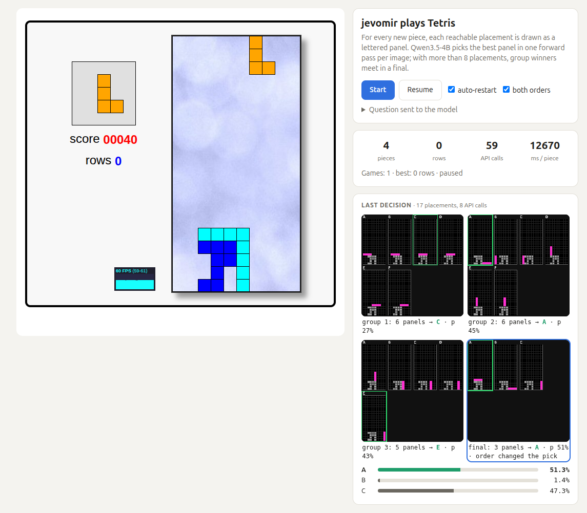

# jevomir plays Tetris

The model plays [javascript-tetris](https://github.com/jakesgordon/javascript-tetris)
(MIT, vendored unmodified in `game/`) live through the [scoring API](../API.md).



```bash
echo 'jev_...' > tetris/.api-key       # git-ignored; or export JEVOMIR_API_KEY=jev_...
python tetris/server.py --api-url https://....ngrok-free.dev   # default: api_server.py on :8100
```

Open <http://127.0.0.1:8090> and press Start.

## How a move is chosen

1. When a new piece spawns, `index.html` (which drives the game in a same-origin iframe)
   lists every placement reachable by rotating at the spawn position, moving sideways and
   dropping, deduplicated by the cells it fills (up to ~34). Not included: sliding under an
   overhang after a soft drop, and rotating after moving.
2. Placements are drawn as lettered panels, 8 per 448x448 image (the API's input size): the
   current board in gray, the piece in magenta, rows it would clear outlined in green.
3. Each image goes to `/v1/score` with the options `Panel A`, `Panel B`, ... and a question
   asking for the best resulting board (editable on the page). With more than 8 placements,
   the winners of each group meet in a final.
4. With "both orders" on (default), every group is also scored with the panels reversed and
   the two probabilities per placement are averaged, because the model prefers some letters
   regardless of content (see "Order can change the result" in API.md).
5. The chosen placement is played with the game's own actions (rotate, move, drop).

The "Last decision" panel shows every image the model saw for the last piece (each group
and the final, winner outlined); click one to see its probabilities.

Gravity is disabled while jevomir drives, so API latency does not cost it anything;
with both orders a piece takes about 4-10 API calls. A free ngrok tunnel drops connections
above ~100 requests a minute, so `server.py` spaces calls to 90 a minute (`--max-per-minute`,
0 turns it off); run it next to `api_server.py` to avoid the tunnel and the limit.

No heuristic ranks or filters the placements: the model sees all of them and decides alone,
so expect a 4B VLM to play poorly.
